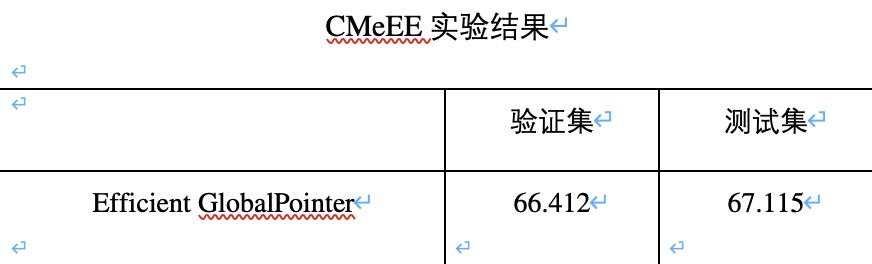

## 如何运行
1. 对应模型EfficientGlobalPointerNet,可以运行阿里的医疗大赛数据。
2. config.ini文件可配置所需的参数。
3. run_model文件夹下运行globalpointer_train.py即可训练,inference_model文件夹下运行inference.py即可推理。
4. 支持Globalpointer为DDP多卡形式，修改多卡形式,运行脚本run_globalpointer即可，运行ddp_inference或者inference都可得到结果。
5. https://github.com/powerycy/DeepKg 支持其他的NER形式跟DDP的配置修改。

